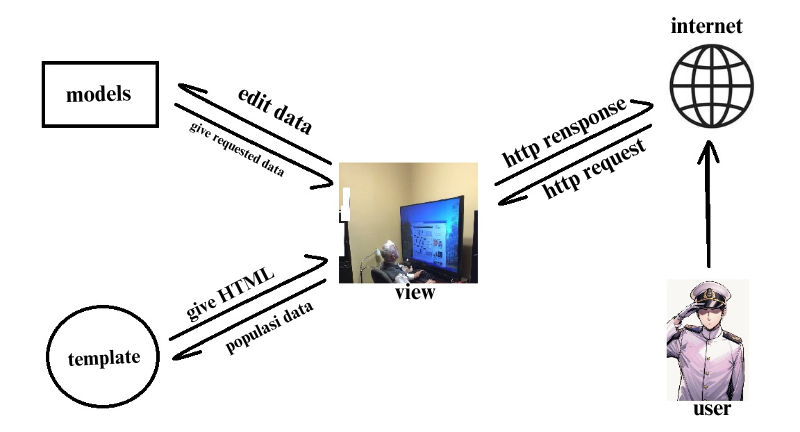

# Bemostore
[Toko Topup Azur Lane BEMOSTORE](http://muhammad-fawwaz35-mentalhealthtracker1.pbp.cs.ui.ac.id)


# Penjelasan Implementasi
### 1. Membuat Proyek Django Baru
Saya memulai dengan membuat repositori baru di github dengan nama bemostore, kemudian saya menduplikat repositori tersebut ke dalam file lokal. Selanjutnya saya membuat proyek django baru yang kemudian menghasilkan struktur folder utama Django, yaitu `bemostore/`. Di sini, Django secara otomatis menghasilkan file konfigurasi dasar seperti `settings.py`, `urls.py`, dan lainnya.

Perintah yang digunakan:  
```
django-admin startproject myproject
```
### 2. Membuat Aplikasi Dengan Nama `Main`
Setelah proyek utama dibuat, saya menambahkan aplikasi baru bernama `main`. Aplikasi ini akan menjadi tempat utama untuk menyimpan logika bisnis, model, views, dan template.

Perintah yang digunakan:
```bash
python manage.py startapp main
```

Selanjutnya, saya menambahkan aplikasi main ke daftar aplikasi yang terinstall (INSTALLED_APPS) di dalam settings.py, sehingga Django mengenali aplikasi ini.
### 3. Routing Proyek untuk Menjalankan Aplikasi `main`
Pada langkah ini, saya mengatur `urls.py` untuk memetakan permintaan (request) ke aplikasi `main`. Saya memodifikasi `bemostore/urls.py` agar menggunakan routing dari aplikasi `main`.

Perintah yang digunakan:
```bash
from django.contrib import admin
from django.urls import path, include

urlpatterns = [
    path('admin/', admin.site.urls),
    path('', include('main.urls')),
]
```
### 4. Membuat Model Product
Di aplikasi main, saya mendefinisikan sebuah model Product di `models.py` yang memiliki atribut `name`, `price`, dan `description`. Model ini akan merepresentasikan tabel di database yang menyimpan produk dengan detail lengkap.

Model `Product`:
``` bash
from django.db import models

class Product(models.Model):
    name = models.CharField(max_length=255)
    price = models.IntegerField()
    description = models.TextField()  
```
Setelah mendefinisikan model, saya melakukan migrasi untuk membuat tabel di database menggunakan perintah:
```bash
python manage.py makemigrations
python manage.py migrate
```
### 5. Membuat Fungsi View dan Template HTML
Di dalam `views.py`, saya membuat fungsi bernama `show_main` yang akan dikembalikan ke template HTML. Fungsi ini mengirimkan context berupa nama aplikasi, nama, npm, dan kelas saya. Template HTML ini dirender untuk menampilkan informasi tersebut di browser.

`views.py`:
```bash
from django.shortcuts import render

def show_main(request):
    context = {
        'name_aplikasi': 'bemostore',
        'name': 'Muhammad Fawwaz Edsa Fatin Setiawan',
        'npm' : '2306275582',
        'class': 'PBP D'
    }

    return render(request, "main.html", context)
```
Di direktori `main/templates`, saya membuat file `main.html` yang akan menerima context dari `views` dan menampilkan data tersebut dalam format HTML.

main.html:
```bash
<h1>{{name_aplikasi}}</h1>

<h5>Name: </h5>
<p>Muhammad Fawwaz Edsa Fatin Setiawan</p> <!--Ubah sesuai dengan nama kamu -->
<h5>NPM: </h5>
<p>2306275582</p> <!-- Ubah sesuai dengan npm kamu -->
<h5>Class: </h5>
<p>PBP D</p> <!-- Ubah sesuai dengan kelas kamu -->
```
### 6. Routing untuk View home
Selanjutnya saya membuat routing di `main/urls.py` untuk memetakan URL ke fungsi `main`. Di sini saya memastikan bahwa URL root ('/') diarahkan ke fungsi `main` di `views.py`.

Routing di main/urls.py:
```bash
from django.urls import path
from main.views import show_main

app_name = 'main'

urlpatterns = [
    path('', show_main, name='show_main'),
]
```
### 7. Deployment ke Pacil Web Service (PWS)
Terakhir saya melakukan deployment aplikasi ke Pacil Web Service, platform yang memungkinkan untuk hosting aplikasi secara online.

Langkah-langkah deployment:
  1. Upload Proyek: Pertama buat repository baru di PWS. kemudian Proyek Django di upload ke PWS menggunakan Git untuk clone repositori.
  2. Konfigurasi Web App: Menambahkan URL `muhammad-fawwaz35-bemostore.pbp.cs.ui.ac.id` ke dalam `ALLOWED_HOST` pada `settings.py` agar pws dapat menunjuk ke proyek Django
  4. Tes Deployment: Saya memastikan bahwa aplikasi berjalan dengan baik di URL yang disediakan oleh Pacil Web Service.
### 8. Aplikasi Siap Dijalankan
Aplikasi dapat diakses melalui URL http://muhammad-fawwaz35-bemostore.pbp.cs.ui.ac.id

# Bagan Proses _Request Client_ ke Aplikasi

### Penjelasan 
Pertama, user akan mengirimkan HTTP request yang kemudian akan di-handle oleh View. Untuk mengetahui apa yang diminta dan bagaimana respon yang akan diberikan, hal ini diatur di dalam urls.py. Berdasarkan pola URL yang diminta, akan ditentukan function View mana di views.py yang akan dijalankan. View akan meminta data yang dibutuhkan dari model sesuai dengan yang sudah didefinisikan dalam function View tersebut, dengan mengambil data yang tersedia di models.py. Selanjutnya, View akan meminta berkas HTML untuk diisi dengan data yang diperoleh, dan pemilihan berkas HTML ini juga sudah ditentukan di dalam function View. Setelah itu, berkas HTML yang sudah diisi data akan dikirim kembali ke user dalam bentuk HTTP response.

# Fungsi `git` dalam Pengembangan Perangkat Lunak
`git` adalah sistem pengontrol versi yang berfungsi untuk melacak perubahan kode dalam pengembangan perangkat lunak, memfasilitasi kolaborasi antar pengembang, dan memungkinkan pengelolaan versi proyek dengan mudah. `git` mendukung pembuatan cabang (branch) untuk pengembangan fitur atau perbaikan bug secara terpisah, yang kemudian dapat digabungkan kembali tanpa risiko konflik. Selain itu, `git` memberikan backup otomatis melalui repositori pusat, memungkinkan rollback ke versi sebelumnya, serta mencatat riwayat perubahan dan kontribusi tiap pengembang, menjadikannya alat penting untuk produktivitas, kolaborasi, dan keamanan dalam pengembangan perangkat lunak.

# Mengapa Django Digunakan sebagai Permulaan Pembelajaran?
Karena framework ini mudah dipahami, memiliki dokumentasi lengkap, dan mengikuti prinsip "batteries included," di mana banyak fitur sudah tersedia tanpa perlu instalasi tambahan. Django menggunakan pola arsitektur yang jelas, yaitu Model-View-Template (MVT), yang memudahkan pemahaman tentang alur kerja aplikasi web. Selain itu, Django memberikan keamanan bawaan dan mendukung praktik terbaik dalam pengelolaan database, routing, dan rendering template.

# Mengapa Model di Django Disebut sebagai ORM?
Disebut sebagai ORM (Object-Relational Mapping) karena berfungsi sebagai penghubung antara objek Python dan tabel di database relasional. ORM memungkinkan pengembang bekerja dengan data dalam bentuk objek Python, sehingga mereka bisa melakukan operasi database seperti mengambil, menyimpan, atau menghapus data tanpa menulis kueri SQL secara langsung. ORM secara otomatis mengonversi operasi objek Python menjadi perintah SQL yang sesuai, memudahkan interaksi dengan database dan membuat kode lebih bersih serta mudah dipahami. 
