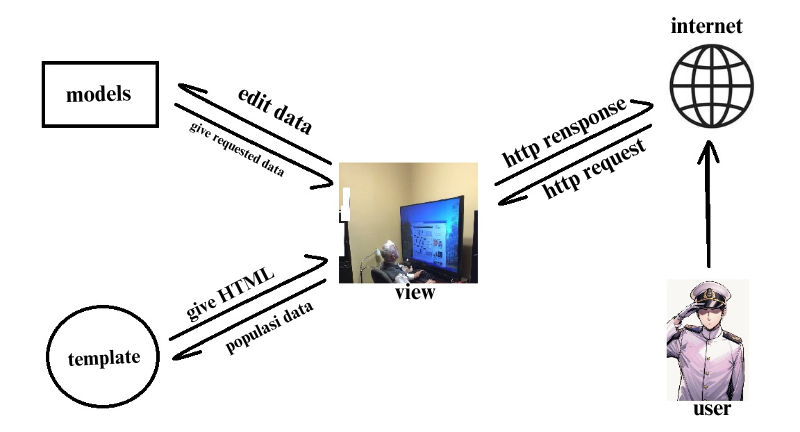
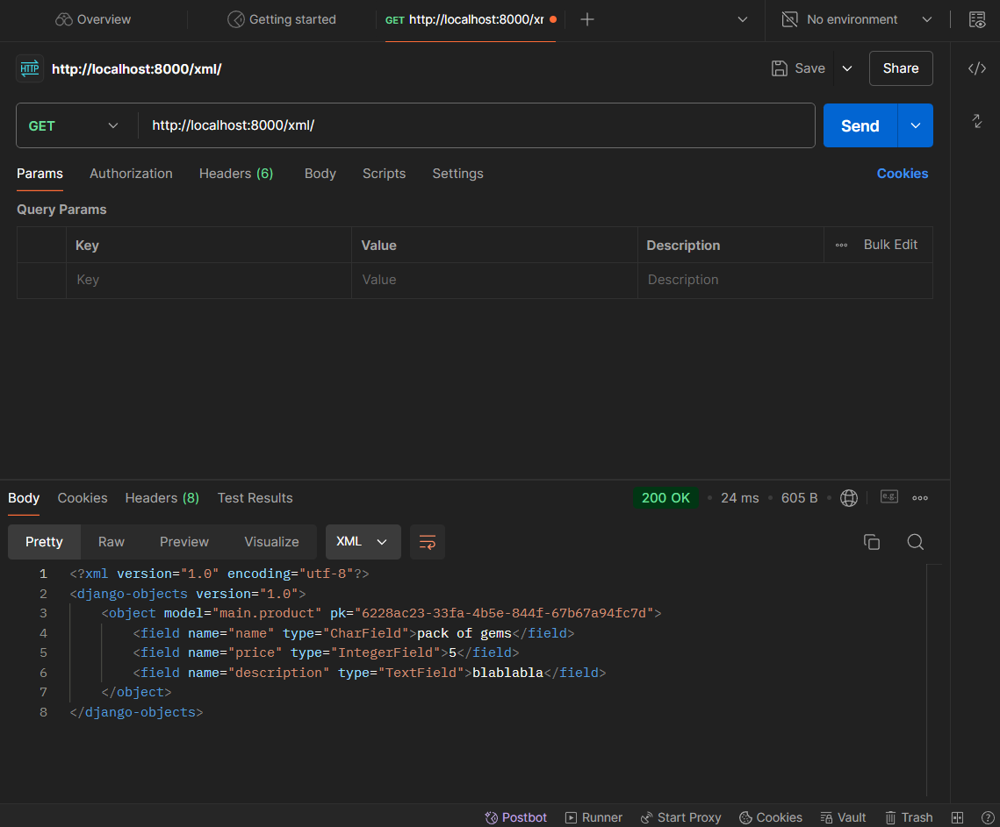
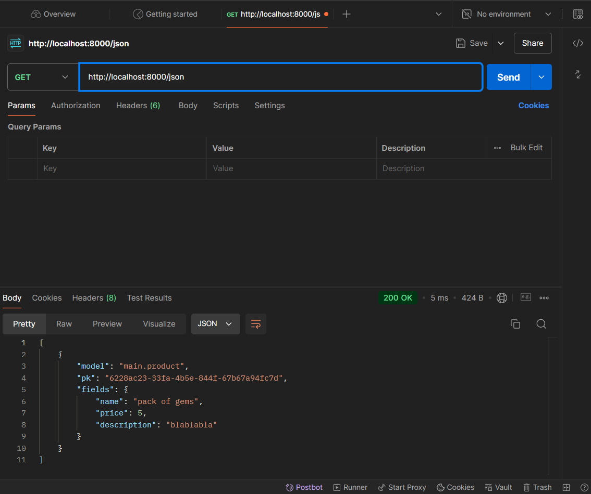
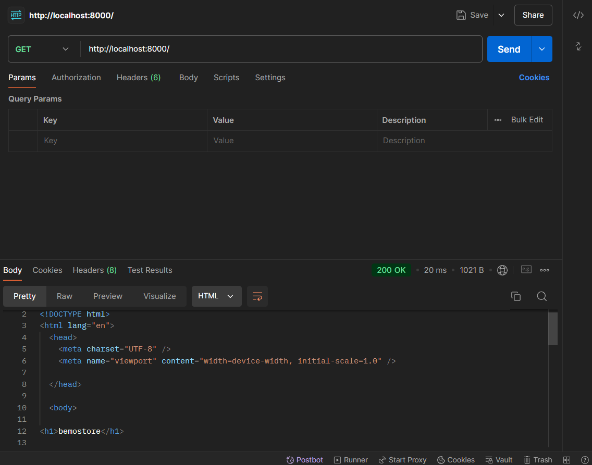
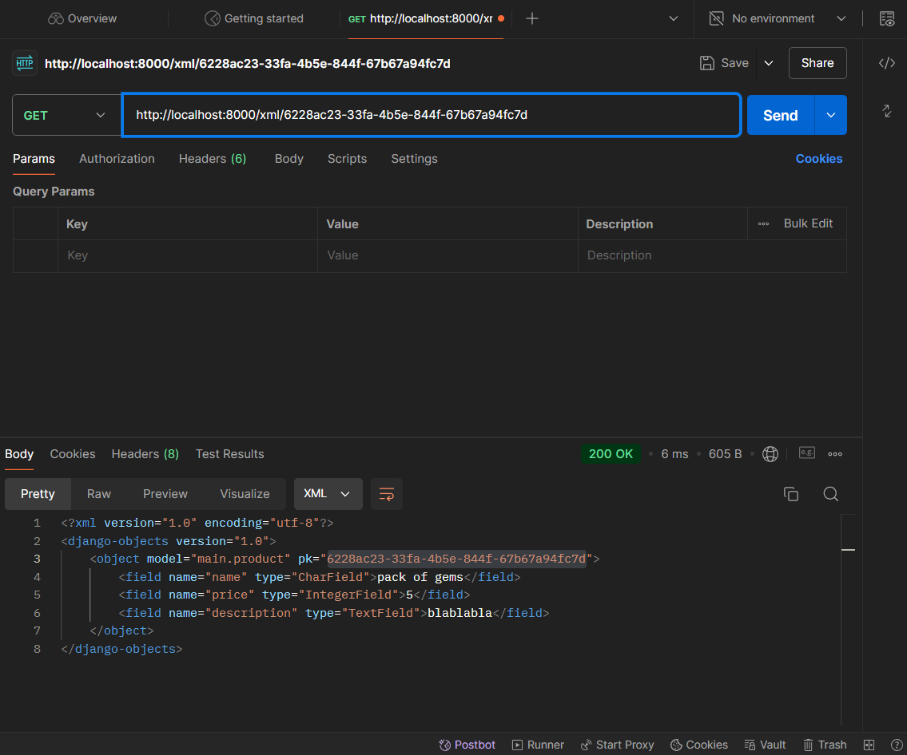
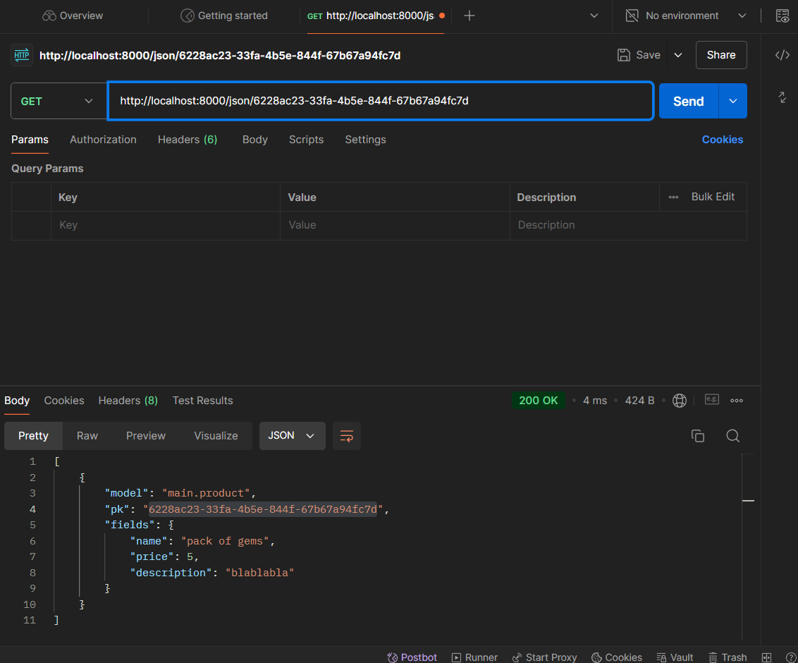

# Bemostore
[Toko Topup Azur Lane BEMOSTORE](http://muhammad-fawwaz35-bemostore.pbp.cs.ui.ac.id)

sebuah web topup oleh Muhammad Fawwaz E.F.S dengan NPM 2306275582

<details>
<summary> <b> Tugas 2: Implementasi Model-View-Template (MVT) pada Django </b> </summary>
    
# Penjelasan Implementasi
### 1. Membuat Proyek Django Baru
Saya memulai dengan membuat repositori baru di github dengan nama bemostore, kemudian saya menduplikat repositori tersebut ke dalam file lokal. Selanjutnya saya membuat proyek django baru yang kemudian menghasilkan struktur folder utama Django, yaitu `bemostore/`. Di sini, Django secara otomatis menghasilkan file konfigurasi dasar seperti `settings.py`, `urls.py`, dan lainnya.

Perintah yang digunakan:  
```
django-admin startproject myproject
```
### 2. Membuat Aplikasi Dengan Nama `Main`
Setelah proyek utama dibuat, saya menambahkan aplikasi baru bernama `main`. Aplikasi ini akan menjadi tempat utama untuk menyimpan logika bisnis, model, views, dan template.

Perintah yang digunakan:
```bash
python manage.py startapp main
```

Selanjutnya, saya menambahkan aplikasi main ke daftar aplikasi yang terinstall (INSTALLED_APPS) di dalam settings.py, sehingga Django mengenali aplikasi ini.
### 3. Routing Proyek untuk Menjalankan Aplikasi `main`
Pada langkah ini, saya mengatur `urls.py` untuk memetakan permintaan (request) ke aplikasi `main`. Saya memodifikasi `bemostore/urls.py` agar menggunakan routing dari aplikasi `main`.

Perintah yang digunakan:
```bash
from django.contrib import admin
from django.urls import path, include

urlpatterns = [
    path('admin/', admin.site.urls),
    path('', include('main.urls')),
]
```
### 4. Membuat Model Product
Di aplikasi main, saya mendefinisikan sebuah model Product di `models.py` yang memiliki atribut `name`, `price`, dan `description`. Model ini akan merepresentasikan tabel di database yang menyimpan produk dengan detail lengkap.

Model `Product`:
```bash
from django.db import models

class Product(models.Model):
    name = models.CharField(max_length=255)
    price = models.IntegerField()
    description = models.TextField()  
```
Setelah mendefinisikan model, saya melakukan migrasi untuk membuat tabel di database menggunakan perintah:
```bash
python manage.py makemigrations
python manage.py migrate
```
### 5. Membuat Fungsi View dan Template HTML
Di dalam `views.py`, saya membuat fungsi bernama `show_main` yang akan dikembalikan ke template HTML. Fungsi ini mengirimkan context berupa nama aplikasi, nama, npm, dan kelas saya. Template HTML ini dirender untuk menampilkan informasi tersebut di browser.

`views.py`:
```bash
from django.shortcuts import render

def show_main(request):
    context = {
        'name_aplikasi': 'bemostore',
        'name': 'Muhammad Fawwaz Edsa Fatin Setiawan',
        'npm' : '2306275582',
        'class': 'PBP D'
    }

    return render(request, "main.html", context)
```
Di direktori `main/templates`, saya membuat file `main.html` yang akan menerima context dari `views` dan menampilkan data tersebut dalam format HTML.

main.html:
```bash
<h1>{{name_aplikasi}}</h1>

<h5>Name: </h5>
<p>Muhammad Fawwaz Edsa Fatin Setiawan</p> <!--Ubah sesuai dengan nama kamu -->
<h5>NPM: </h5>
<p>2306275582</p> <!-- Ubah sesuai dengan npm kamu -->
<h5>Class: </h5>
<p>PBP D</p> <!-- Ubah sesuai dengan kelas kamu -->
```
### 6. Routing untuk View home
Selanjutnya saya membuat routing di `main/urls.py` untuk memetakan URL ke fungsi `main`. Di sini saya memastikan bahwa URL root ('/') diarahkan ke fungsi `main` di `views.py`.

Routing di main/urls.py:
```bash
from django.urls import path
from main.views import show_main

app_name = 'main'

urlpatterns = [
    path('', show_main, name='show_main'),
]
```

### 7. Deployment ke Pacil Web Service (PWS)
Terakhir saya melakukan deployment aplikasi ke Pacil Web Service, platform yang memungkinkan untuk hosting aplikasi secara online.

Langkah-langkah deployment:
  1. Upload Proyek: Pertama buat repository baru di PWS. kemudian Proyek Django di upload ke PWS menggunakan Git untuk clone repositori.
  2. Konfigurasi Web App: Menambahkan URL `muhammad-fawwaz35-bemostore.pbp.cs.ui.ac.id` ke dalam `ALLOWED_HOST` pada `settings.py` agar pws dapat menunjuk ke proyek Django
  4. Tes Deployment: Saya memastikan bahwa aplikasi berjalan dengan baik di URL yang disediakan oleh Pacil Web Service.
### 8. Aplikasi Siap Dijalankan
Aplikasi dapat diakses melalui URL http://muhammad-fawwaz35-bemostore.pbp.cs.ui.ac.id

# Bagan Proses _Request Client_ ke Aplikasi

### Penjelasan 
Pertama, user akan mengirimkan HTTP request yang kemudian akan di-handle oleh View. Untuk mengetahui apa yang diminta dan bagaimana respon yang akan diberikan, hal ini diatur di dalam urls.py. Berdasarkan pola URL yang diminta, akan ditentukan function View mana di views.py yang akan dijalankan. View akan meminta data yang dibutuhkan dari model sesuai dengan yang sudah didefinisikan dalam function View tersebut, dengan mengambil data yang tersedia di models.py. Selanjutnya, View akan meminta berkas HTML untuk diisi dengan data yang diperoleh, dan pemilihan berkas HTML ini juga sudah ditentukan di dalam function View. Setelah itu, berkas HTML yang sudah diisi data akan dikirim kembali ke user dalam bentuk HTTP response.

# Fungsi `git` dalam Pengembangan Perangkat Lunak
`git` adalah sistem pengontrol versi yang berfungsi untuk melacak perubahan kode dalam pengembangan perangkat lunak, memfasilitasi kolaborasi antar pengembang, dan memungkinkan pengelolaan versi proyek dengan mudah. `git` mendukung pembuatan cabang (branch) untuk pengembangan fitur atau perbaikan bug secara terpisah, yang kemudian dapat digabungkan kembali tanpa risiko konflik. Selain itu, `git` memberikan backup otomatis melalui repositori pusat, memungkinkan rollback ke versi sebelumnya, serta mencatat riwayat perubahan dan kontribusi tiap pengembang, menjadikannya alat penting untuk produktivitas, kolaborasi, dan keamanan dalam pengembangan perangkat lunak.

# Mengapa Django Digunakan sebagai Permulaan Pembelajaran?
Karena framework ini mudah dipahami, memiliki dokumentasi lengkap, dan mengikuti prinsip "batteries included," di mana banyak fitur sudah tersedia tanpa perlu instalasi tambahan. Django menggunakan pola arsitektur yang jelas, yaitu Model-View-Template (MVT), yang memudahkan pemahaman tentang alur kerja aplikasi web. Selain itu, Django memberikan keamanan bawaan dan mendukung praktik terbaik dalam pengelolaan database, routing, dan rendering template.

# Mengapa Model di Django Disebut sebagai ORM?
Disebut sebagai ORM (Object-Relational Mapping) karena berfungsi sebagai penghubung antara objek Python dan tabel di database relasional. ORM memungkinkan pengembang bekerja dengan data dalam bentuk objek Python, sehingga mereka bisa melakukan operasi database seperti mengambil, menyimpan, atau menghapus data tanpa menulis kueri SQL secara langsung. ORM secara otomatis mengonversi operasi objek Python menjadi perintah SQL yang sesuai, memudahkan interaksi dengan database dan membuat kode lebih bersih serta mudah dipahami. 
</details>

<details>
<summary> <b> Tugas 3: Implementasi Form dan Data Delivery pada Django </b> </summary>

# Pentingnya Data Delivery dalam Platform

Data delivery penting dalam platform untuk memastikan komunikasi yang efektif antar komponen seperti server, klien, dan basis data. Proses ini memungkinkan pertukaran informasi yang tepat, misalnya dalam aplikasi web di mana server mengirimkan data (seperti JSON) ke klien. Tanpa mekanisme ini, interaksi antara komponen tidak akan berjalan optimal, menyebabkan kinerja platform menurun.

# Perbandingan XML dan JSON serta Popularitas JSON

JSON lebih populer daripada XML karena lebih sederhana, ringan, dan mudah diproses, terutama di JavaScript. JSON menggunakan sintaks yang lebih ringkas dibandingkan XML yang memakai tag panjang. Selain itu, JSON lebih cepat diparsing dan didukung secara luas oleh berbagai bahasa pemrograman. XML tetap berguna untuk struktur data kompleks, namun JSON lebih efisien untuk pertukaran data modern.

# Fungsi `is_valid()` pada Form Django

Method `is_valid()` di Django memvalidasi data yang diinput dalam form. Jika data valid, method ini mengembalikan `True`, memungkinkan data diproses lebih lanjut. Jika tidak, pesan kesalahan ditampilkan. Fungsi ini penting untuk menjaga data yang masuk tetap konsisten dan aman, serta menghindari input yang berbahaya atau salah.

# Pentingnya `csrf_token` pada Form di Django

`csrf_token` melindungi aplikasi Django dari serangan CSRF, di mana penyerang mencoba mengirim permintaan tidak sah atas nama pengguna. Token ini memastikan bahwa setiap permintaan form datang dari sumber yang tepercaya. Tanpa `csrf_token`, aplikasi rentan terhadap serangan yang bisa mengakibatkan perubahan data atau tindakan tidak diinginkan.

# Jelaskan bagaimana cara kamu mengimplementasikan checklist di atas secara step-by-step.

### 1. Buat sebuah file `base.html` pada folder baru bernama `templates` pada direktori utama
```bash

<!DOCTYPE html>
<html lang="en">
  <head>
    <meta charset="UTF-8" />
    <meta name="viewport" content="width=device-width, initial-scale=1.0" />
     
  </head>

  <body>
     
  </body>
</html>
```

### 2. Menambahkan baris pada variabel `TEMPLATES` di `settings.py` agar `base.html` terbaca
```bash
...
TEMPLATES :
        ...
        'DIRS': [BASE_DIR / 'templates'],
        ...
...
```

### 3. Tambahkan import uuid di `models.py` dan Lakukan Migration
import uuid
Kemudian, buat model yang menggunakan UUID, misalnya:

```bash
from django.db import models
import uuid

class Product(models.Model):
    id = models.UUIDField(primary_key=True, default=uuid.uuid4, editable=False) 
    name = models.CharField(max_length=255)
    price = models.IntegerField()
    description = models.TextField()  
```
Setelah mengedit model, jalankan migrasi dengan perintah:
```bash
python manage.py makemigrations
python manage.py migrate
```

### 4. Buat file `forms.py` untuk Mengambil Data dari `models.py`
```bash
from django.forms import ModelForm
from main.models import Product

class ProductEntryForm(ModelForm):
    class Meta:
        model = Product
        fields = ["name", "price", "description"]
```

### 5. Membuat file baru pada direktori `main/template` untuk tampilan dalam menambahkan item baru dengan nama `create_product_entry.html` 
```bash


<h1>Add New Product</h1>

<form method="post">
    
    <table>
        {{ form.as_table }}
        <tr> 
            <td>
                <input type="submit" value="Add Product" \>
            </td>
        </tr>
    </table>
</form>

```

### 6. Menambahkan fungsi pada `views.py` dan memodifikasi fungsi di dalamnya
```bash
from django.shortcuts import render, redirect   # Tambahkan import redirect di baris ini
from main.forms import ProductEntryForm
from main.models import Product
from django.http import HttpResponse
from django.core import serializers

def show_main(request):
    product_entries = Product.objects.all()

    context = {
        'name_aplikasi': 'bemostore',
        'name': 'Muhammad Fawwaz Edsa Fatin Setiawan',
        'npm' : '2306275582',
        'class': 'PBP D',
        'product_entries': product_entries
    }

    return render(request, "main.html", context)

def create_product_entry(request):
    form = ProductEntryForm(request.POST or None)

    if form.is_valid() and request.method == "POST":
        form.save()
        return redirect('main:show_main')

    context = {'form': form}
    return render(request, "create_product_entry.html", context)

def show_xml(request):
    data = Product.objects.all()
    return HttpResponse(serializers.serialize("xml", data), content_type="application/xml")

def show_json(request):
    data = Product.objects.all()
    return HttpResponse(serializers.serialize("json", data), content_type="application/json")

def show_xml_by_id(request, id):
    data = Product.objects.filter(pk=id)
    return HttpResponse(serializers.serialize("xml", data), content_type="application/xml")

def show_json_by_id(request, id):
    data = Product.objects.filter(pk=id)
    return HttpResponse(serializers.serialize("json", data), content_type="application/json")
```

### 7. Menambahkan routing url pada `urls.py` pada views yang telah ditambahkan
```python
from django.urls import path
from main.views import show_main, create_product_entry, show_xml, show_json, show_xml_by_id, show_json_by_id

app_name = 'main'

urlpatterns = [
    path('', show_main, name='show_main'),
    path('create-product-entry', create_product_entry, name='create_product_entry'),
    path('xml/', show_xml, name='show_xml'),
    path('json/', show_json, name='show_json'),
    path('xml/<str:id>/', show_xml_by_id, name='show_xml_by_id'),
    path('json/<str:id>/', show_json_by_id, name='show_json_by_id'),
]
```

# Mengakses keempat URL di poin 2 menggunakan Postman
### 1. XML 

### 2. JSON

### 3. HTML

### 4. XML by ID

### 5. JSON by ID


</details>

<details>
<summary> <b> Tugas 4: Implementasi Autentikasi, Session, dan Cookies pada Django </b> </summary>
    
# Perbedaan antara `HttpResponseRedirect()` dan `redirect()` dalam Django:
- `HttpResponseRedirect()`: Sebuah kelas di Django yang mengirimkan respons HTTP dengan kode status 302 (redirect). Biasanya, kita harus memberikan URL secara manual ke `HttpResponseRedirect`. 

- `redirect()`: Fungsi ini adalah shortcut yang lebih nyaman daripada `HttpResponseRedirect`. Fungsi `redirect()` akan secara otomatis menangani URL, termasuk menerima nama tampilan (view name) atau objek model dan mengarahkan pengguna ke halaman yang tepat.

 Dengan kata lain, `redirect()` adalah pembungkus di atas `HttpResponseRedirect`, yang lebih fleksibel dan mudah digunakan karena tidak hanya menerima URL tetapi juga nama view atau objek.

# Cara kerja penghubungan model `Product` dengan `User`:
Untuk menghubungkan model `Product` dengan `User`, biasanya kita menggunakan `ForeignKey` atau `ManyToManyField` dalam model Django. Misalnya, kita dapat memiliki hubungan "satu ke banyak" (one-to-many) di mana satu pengguna bisa memiliki banyak produk, tetapi setiap produk hanya dimiliki oleh satu pengguna.

   Contoh model:

   ```python
    ...
       owner = models.ForeignKey(User, on_delete=models.CASCADE)  # Hubungan dengan User
    ...
   ```

Dalam contoh ini:
- Model `Product` memiliki `ForeignKey` ke model `User`, yang artinya setiap produk dimiliki oleh seorang pengguna. Field `owner` menghubungkan produk dengan pengguna yang memiliki produk tersebut.
- Jika pengguna dihapus, maka produk-produk yang dimilikinya juga akan dihapus berkat opsi `on_delete=models.CASCADE`.

# Perbedaan antara authentication dan authorization:
- **Authentication**: Proses memverifikasi identitas pengguna, misalnya memeriksa apakah username dan password cocok dengan yang ada di database.
- **Authorization**: Proses memeriksa izin atau hak akses pengguna, yaitu menentukan apakah pengguna yang telah diotentikasi (authenticated) memiliki hak untuk melakukan tindakan tertentu (misalnya, mengakses halaman admin).

**Saat pengguna login**, yang dilakukan pertama kali adalah proses *authentication* (pemeriksaan kredensial). Jika berhasil, pengguna diizinkan untuk masuk ke aplikasi. Setelah itu, *authorization* terjadi saat aplikasi memeriksa hak akses pengguna untuk fitur atau halaman tertentu.

**Implementasi di Django**:
- *Authentication* di Django biasanya dilakukan dengan sistem login bawaan (`django.contrib.auth`) yang memverifikasi username dan password pengguna.
- *Authorization* dilakukan menggunakan mekanisme izin dan kelompok (permissions and groups) yang ada dalam model pengguna. Dengan cara ini, Django mengelola apa yang dapat diakses oleh setiap pengguna setelah mereka terotentikasi.

# **Bagaimana Django mengingat pengguna yang telah login?**
Django menggunakan **session** untuk mengingat pengguna yang telah login. Setelah pengguna berhasil login, Django akan menyimpan informasi sesi di server (biasanya dalam database) dan menambahkan cookie ke browser pengguna yang berisi ID sesi. Setiap kali pengguna melakukan permintaan baru, browser mengirimkan cookie ini, dan Django akan mencocokkannya dengan data sesi di server untuk mengidentifikasi pengguna yang telah login.

**Kegunaan lain dari cookies:**
- Cookies digunakan untuk melacak sesi pengguna (misalnya, di e-commerce, untuk keranjang belanja).
- Digunakan untuk menyimpan preferensi pengguna, seperti tema atau bahasa.
- Digunakan oleh layanan pihak ketiga (seperti Google Analytics) untuk pelacakan dan analisis.

**Apakah semua cookies aman digunakan?**
Tidak semua cookies aman. Cookies bisa saja digunakan untuk serangan seperti *session hijacking* atau *cross-site scripting (XSS)*. Oleh karena itu, penting untuk:
- Menggunakan **Secure Cookies** (hanya dikirim melalui HTTPS).
- Menggunakan **HttpOnly Cookies** (yang tidak dapat diakses oleh JavaScript, sehingga meminimalkan risiko XSS).
- Mengatur **SameSite Cookies** untuk membatasi pengiriman cookies lintas situs.

#  Jelaskan bagaimana cara kamu mengimplementasikan checklist di atas secara step-by-step.
### 1. Membuat fungsi register 
Menambahkan fungsi `register` pada `views.py` dan membuat tampilannya dengan membuat `register.html` pada `\main\template`
fungsi register pada `views.py` :
``` python
def register(request):
    form = UserCreationForm()

    if request.method == "POST":
        form = UserCreationForm(request.POST)
        if form.is_valid():
            form.save()
            messages.success(request, 'Your account has been successfully created!')
            return redirect('main:login')
    context = {'form':form}
    return render(request, 'register.html', context)
```
`regisster.html`
```bash



<title>Register</title>




<div class="login">
  <h1>Register</h1>

  <form method="POST">
    
    <table>
      {{ form.as_table }}
      <tr>
        <td></td>
        <td><input type="submit" name="submit" value="Daftar" /></td>
      </tr>
    </table>
  </form>

  
  <ul>
    
    <li>{{ message }}</li>
    
  </ul>
  
</div>


```
### 2. Membuat fungsi login 
Menambahkan fungsi `login_user` pada `views.py` untuk login user yang telah registrasi dan membuat tampilannya dengan membuat `login.html` pada `\main\template`
login pada `views.py`
```python
def login_user(request):
   if request.method == 'POST':
      form = AuthenticationForm(data=request.POST)

      if form.is_valid():
        user = form.get_user()
        login(request, user)
        response = HttpResponseRedirect(reverse("main:show_main"))
        response.set_cookie('last_login', str(datetime.datetime.now()))
        return response

   else:
      form = AuthenticationForm(request)
   context = {'form': form}
   return render(request, 'login.html', context)
```
`login.html`
```bash



<title>Login</title>



<div class="login">
  <h1>Login</h1>

  <form method="POST" action="">
    
    <table>
      {{ form.as_table }}
      <tr>
        <td></td>
        <td><input class="btn login_btn" type="submit" value="Login" /></td>
      </tr>
    </table>
  </form>

  
  <ul>
    
    <li>{{ message }}</li>
    
  </ul>
   Don't have an account yet?
  <a href="">Register Now</a>
</div>


```
### 3. Mmebuat fungsi logout
Menambahkan fungsi `logout_user` pada `views.py` untuk logout user yang sedang login dan membuat tampilan tombol logout pada `main.html`.
```python
def logout_user(request):
    logout(request)
    response = HttpResponseRedirect(reverse('main:login'))
    response.delete_cookie('last_login')
    return response
```
tombol logout pada `main.html`
```python
<a href="">
  <button>Logout</button>
</a>
```
### 4. Menambahkan URL untuk setiap fungsi yang telah dibuat
```python
    ...
    path('register/', register, name='register'),
    path('login/', login_user, name='login'),
    path('logout/', logout_user, name='logout'),
    ...
```
### 5. Menghubungkan product dengan user
Menambahkan field baru berupa `user` pada `models.py` agar masing-masing user dapat melihat product yang telah dibuat.
```python
    ...
    id = models.UUIDField(primary_key=True, default=uuid.uuid4, editable=False) 
    ...
```
Jalankan migrasi
```
python manage.py makemigrations
python manage.py migrate
```
### 6. Menampilkan detail pengguna yang sedang login dan waktu sesi terakhir login
menambahkan detail pengguna pada `views.py` yang menampilkan nama pengguna yang sudah login terlebih dahulu
```python
    @login_required(login_url='/login')
    ...
    'name': request.user.username,
    'last_login': request.COOKIES['last_login'],
    ...
```
### 7. Menampilkan sesi login terakhir pengguna pada `main.html`
```bash
<h5>Sesi terakhir login: {{ last_login }}</h5>
```

</details>

<details>
<summary> <b> Tugas 5: Desain Web menggunakan HTML, CSS dan Framework CSS </b> </summary>

#  Jika terdapat beberapa CSS selector untuk suatu elemen HTML, jelaskan urutan prioritas pengambilan CSS selector tersebut!
Ketika sebuah elemen HTML memiliki lebih dari satu CSS selector yang bisa diterapkan, CSS memiliki aturan prioritas yang disebut *specificity*. Berikut adalah urutan prioritas dari yang paling rendah ke yang paling tinggi:

- **Elemen (Tag) Selector**: Misalnya, `div`, `p`, `h1`. Selector ini memiliki prioritas paling rendah.
- **Class Selector**: Misalnya, `.class-name`. Class lebih spesifik daripada elemen, jadi memiliki prioritas lebih tinggi.
- **ID Selector**: Misalnya, `#id-name`. Selector ID lebih spesifik daripada class.
- **Inline Style**: Gaya yang ditulis langsung pada elemen HTML, misalnya, `<p style="color: red;">`. Ini memiliki prioritas lebih tinggi daripada selector lainnya.
- **!important**: Jika sebuah aturan CSS diberi tanda `!important`, itu akan selalu menang atas aturan lainnya, bahkan inline styles.

**Urutan Contoh:**
```html
<div id="example" class="example-class">Hello, World!</div>
```

```css
div { color: blue; }          /* Elemen selector */
.example-class { color: red; } /* Class selector */
#example { color: green; }     /* ID selector */
```
Dalam contoh di atas, warna teks akan menjadi **hijau** karena ID selector memiliki prioritas tertinggi.

#  Mengapa responsive design menjadi konsep yang penting dalam pengembangan aplikasi web? Berikan contoh aplikasi yang sudah dan belum menerapkan responsive design!
Responsive design adalah konsep di mana desain dan tata letak aplikasi web berubah secara dinamis berdasarkan ukuran layar atau perangkat pengguna, seperti ponsel, tablet, atau desktop. Konsep ini penting karena:

- **Kenyamanan Pengguna**: Pengguna bisa mengakses aplikasi dari berbagai perangkat tanpa kehilangan kualitas pengalaman.
- **Peningkatan Keterjangkauan**: Desain yang responsif membantu situs web mencapai lebih banyak pengguna, terutama pengguna seluler yang terus meningkat.
- **SEO Friendly**: Google memberikan peringkat lebih tinggi pada situs web yang responsif.
  
**Contoh Aplikasi yang Menerapkan Responsive Design**:
- **Sudah Menerapkan**: 
  - **YouTube**: Tata letak video berubah sesuai dengan ukuran layar, menyesuaikan navigasi dan jumlah kolom video yang ditampilkan.
  - **Twitter**: Desain halaman utamanya berubah, baik untuk desktop maupun untuk ponsel.
  
- **Belum Menerapkan**:
  - **Beberapa website pemerintah**
    
#  Jelaskan perbedaan antara margin, border, dan padding, serta cara untuk mengimplementasikan ketiga hal tersebut!

- **Margin**: Jarak di luar *border* elemen. *Margin* digunakan untuk membuat ruang antara elemen satu dengan elemen lainnya.
  
- **Border**: Garis yang mengelilingi *padding* dan *content* dari sebuah elemen. *Border* terletak di antara *margin* dan *padding*.
  
- **Padding**: Jarak antara konten elemen dan *border*-nya. *Padding* digunakan untuk memberi ruang di dalam elemen, antara konten dan *border*.

**Contoh Implementasi**:
```css
.div-example {
  margin: 10px;        /* Jarak di luar elemen */
  border: 2px solid black; /* Garis di sekitar padding */
  padding: 15px;       /* Jarak di dalam border antara konten dan border */
}
```

Dalam ilustrasi tersebut:
- `margin: 10px;` menambahkan jarak di luar elemen.
- `border: 2px solid black;` memberikan garis di sekitar elemen.
- `padding: 15px;` memberikan jarak di dalam elemen antara konten dan *border*.

# Jelaskan konsep flex box dan grid layout beserta kegunaannya!
- **Flexbox (Flexible Box Layout)**:
  Flexbox adalah modul CSS yang dirancang untuk menyusun item dalam satu dimensi (baris atau kolom). Flexbox sangat berguna untuk tata letak yang responsif dan dinamis.

  **Kegunaan Flexbox**:
  - Menyusun elemen dalam satu baris atau kolom.
  - Mengatur aliran elemen secara otomatis, meski ukuran layar berubah.
  - Membantu dalam penyelarasan dan distribusi ruang antar elemen dalam container.

  **Contoh Flexbox**:
  ```css
  .container {
    display: flex;
    justify-content: space-between;
    align-items: center;
  }
  ```

  Pada contoh di atas, elemen-elemen di dalam `.container` akan disusun dalam satu baris dengan jarak antar elemen yang sama (`justify-content: space-between`), dan semuanya akan disejajarkan di tengah secara vertikal (`align-items: center`).

- **Grid Layout**:
  Grid Layout adalah modul CSS yang lebih kompleks daripada Flexbox karena memungkinkan pengaturan tata letak dalam dua dimensi, yaitu baris dan kolom. Grid sangat cocok digunakan untuk membangun struktur halaman yang lebih kompleks, seperti tata letak halaman utama sebuah website.

  **Kegunaan Grid Layout**:
  - Membagi halaman menjadi grid yang terdiri dari baris dan kolom.
  - Lebih mudah untuk membuat desain yang kompleks dengan berbagai ukuran elemen.
  - Mengatur elemen-elemen di dalam layout dengan presisi tinggi.

  **Contoh Grid Layout**:
  ```css
  .grid-container {
    display: grid;
    grid-template-columns: repeat(3, 1fr);
    grid-gap: 10px;
  }
  ```

  Pada contoh di atas, `.grid-container` memiliki 3 kolom yang masing-masing memiliki lebar sama (1fr). *Grid gap* mengatur jarak antar elemen grid.

#  Jelaskan bagaimana cara kamu mengimplementasikan checklist di atas secara step-by-step (bukan hanya sekadar mengikuti tutorial)!

### 1. Menambahkan tailwind untuk styling aplikasi
```html
<head>

    <meta charset="UTF-8" />
    <meta name="viewport" content="width=device-width, initial-scale=1">

<script src="https://cdn.tailwindcss.com">
</script>
</head>
```

### 2. Menambahkan fitur edit product dan menyambungkan path nya serta menampilkannya pada halaman aplikasi
method edit product
``` python
from django.shortcuts import .., reverse
from django.http import .., HttpResponseRedirect
..
def edit_product(request, id):
    product = Product.objects.get(pk = id)

    # Set mood entry sebagai instance dari form
    form = ProductEntryForm(request.POST or None, instance=product)

    if form.is_valid() and request.method == "POST":
        # Simpan form dan kembali ke halaman awal
        form.save()
        return HttpResponseRedirect(reverse('main:show_main'))

    context = {'form': form}
    return render(request, "edit_product.html", context)
```

menyambugnkan path
``` python
from main.views import edit_mood
...
path('edit-mood/<uuid:id>', edit_mood, name='edit_mood'),
...
```

Tampilan untuk aplikasi
``` html



<title>Edit Product</title>




<div class="flex flex-col min-h-screen bg-gray-100">
  <div class="container mx-auto px-4 py-8 mt-16 max-w-xl">
    <h1 class="text-3xl font-bold text-center mb-8 text-black">Edit Product Entry</h1>
  
    <div class="bg-white rounded-lg p-6 form-style">
      <form method="POST" class="space-y-6">
          
          
              <div class="flex flex-col">
                  <label for="{{ field.id_for_label }}" class="mb-2 font-semibold text-gray-700">
                      {{ field.label }}
                  </label>
                  <div class="w-full">
                      {{ field }}
                  </div>
                  
                      <p class="mt-1 text-sm text-gray-500">{{ field.help_text }}</p>
                  
                  
                      <p class="mt-1 text-sm text-red-600">{{ error }}</p>
                  
              </div>
          
          <div class="flex justify-center mt-6">
              <button type="submit" class="bg-indigo-600 text-white font-semibold px-6 py-3 rounded-lg hover:bg-indigo-700 transition duration-300 ease-in-out w-full">
                  Edit Product Entry
              </button>
          </div>
      </form>
  </div>
  </div>
</div>

```

### 3. Menambahkan fitur delete produk

method delete produk
```python
def delete_product(request, id):
    # Get mood berdasarkan id
    product = Product.objects.get(pk = id)
    # Hapus mood
    product.delete()
    # Kembali ke halaman awal
    return HttpResponseRedirect(reverse('main:show_main'))
```

menyambugnkan path
```python
from main.views import edit_mood
...
    path('delete/<uuid:id>', delete_product, name='delete_product'), 

```

### 4. Menambahkan kedua fitur tersebut dan membuat tampilan untuk info produk pada halaman aplikasi
```html
<div class="relative break-inside-avoid max-w-lg mx-auto">
    <div class="relative top-5 bg-indigo-100 shadow-md rounded-lg mb-6 break-inside-avoid flex flex-col border-2 border-indigo-300 p-6 transition-transform duration-300">
      <div class="bg-indigo-200 text-gray-800 p-4 rounded-t-lg border-b-2 border-indigo-300">
        <h3 class="font-bold text-2xl mb-2">{{ product_entry.name }}</h3> <!-- Menampilkan nama produk -->
        <p class="text-gray-600">Created by: {{ product_entry.user.username }}</p> <!-- Menampilkan nama user pembuat -->
      </div>
      <div class="p-4">
        <p class="font-semibold text-2xl mb-4">Price: ${{ product_entry.price }}</p> <!-- Menampilkan harga produk -->
        <p class="text-gray-700 text-lg mb-4">{{ product_entry.description }}</p> <!-- Menampilkan deskripsi produk -->
      </div>
      <div class="flex justify-between mt-6">
        <a href="" class="bg-yellow-500 hover:bg-yellow-600 text-white font-bold py-2 px-4 rounded-lg w-full mr-2 text-center transition duration-300">
          Edit Product
        </a>
        <a href="" class="bg-red-500 hover:bg-red-600 text-white font-bold py-2 px-4 rounded-lg w-full ml-2 text-center transition duration-300">
          Delete Product
        </a>
      </div>
    </div>
</div>
```

### 5. Mmebuat `navbar.html` yang berfungsi untuk fitur aplikasi yang responsive pada mobile dan desktop
```html


<!DOCTYPE html>
<html lang="en">
<head>
    <meta charset="UTF-8">
    <meta name="viewport" content="width=device-width, initial-scale=1.0">
    <title>Responsive Navbar</title>
    <link rel="stylesheet" href="https://cdnjs.cloudflare.com/ajax/libs/font-awesome/6.0.0-beta3/css/all.min.css">
    <style>
        body {
            margin: 0;
            font-family: Arial, Helvetica, sans-serif;
        }
        .navbar {
            background-color: #1b58bb;
            overflow: hidden;
            display: flex;
            justify-content: space-between;
            align-items: center;
            padding: 0 20px;
        }
        .navbar a {
            color: white;
            text-decoration: none;
            padding: 14px 20px;
        }
        .navbar a:hover {
            background-color: #ddd;
            color: black;
        }
        .navbar .logo {
            font-size: 22px;
            font-weight: bold;
            display: flex;
            align-items: center;
        }
        .navbar .logo img {
            height: 40px; /* Sesuaikan ukuran logo */
            margin-right: 10px;
        }
        .navbar .menu {
            display: flex;
            gap: 10px;
        }
        .navbar .menu a {
            padding: 14px 20px;
        }
        .navbar .logout {
            background-color: #E74C3C;
            color: white;
            padding: 10px 20px;
            border-radius: 5px;
        }
        .navbar .logout:hover {
            background-color: #C0392B;
        }
        /* Responsive for mobile */
        @media (max-width: 768px) {
            .navbar .menu {
                display: none;
                flex-direction: column;
                width: 100%;
                position: absolute;
                top: 50px;
                left: 0;
                background-color: #1d85e5;
            }
            .navbar .menu.active {
                display: flex;
            }
            .navbar .menu a {
                text-align: center;
                padding: 14px;
                width: 100%;
                border-bottom: 1px solid #ddd;
            }
            .navbar .hamburger {
                display: block;
                font-size: 24px;
                cursor: pointer;
            }
        }
        /* Hide hamburger in desktop */
        .hamburger {
            display: none;
        }
    </style>
</head>
<body>
    <div class="navbar">
        <div class="logo">
             <!-- Path yang sudah diperbaiki -->
            bemostore
        </div>
        <div class="hamburger"><i class="fas fa-bars"></i></div>
        <div class="menu">
            <a href="#">Home</a>
            <a href="#">Products</a>
            <a href="#">Categories</a>
            <a href="#">Cart</a>
            <a href="#">Welcome, {{user.username}}</a>
            <a href="" class="logout">Logout</a>
        </div>
    </div>

    <script>
        document.querySelector('.hamburger').addEventListener('click', function() {
            document.querySelector('.menu').classList.toggle('active');
        });
    </script>
</body>
</html>
```

### 6. Kustomisasi tampilan login dan register
`login.html`
```html



<title>Login</title>



<div class="min-h-screen flex items-center justify-center w-screen bg-blue-500 py-12 px-4 sm:px-6 lg:px-8">
  <div class="max-w-md w-full space-y-8">
    <div>
      <h2 class="mt-6 text-center text-black text-3xl font-extrabold text-gray-900">
        Login to your account
      </h2>
    </div>
    <form class="mt-8 space-y-6" method="POST" action="">
      
      <input type="hidden" name="remember" value="true">
      <div class="rounded-md shadow-sm -space-y-px">
        <div>
          <label for="username" class="sr-only">Username</label>
          <input id="username" name="username" type="text" required class="appearance-none rounded-none relative block w-full px-3 py-2 border border-gray-300 placeholder-gray-500 text-gray-900 rounded-t-md focus:outline-none focus:ring-indigo-500 focus:border-indigo-500 focus:z-10 sm:text-sm" placeholder="Username">
        </div>
        <div>
          <label for="password" class="sr-only">Password</label>
          <input id="password" name="password" type="password" required class="appearance-none rounded-none relative block w-full px-3 py-2 border border-gray-300 placeholder-gray-500 text-gray-900 rounded-b-md focus:outline-none focus:ring-indigo-500 focus:border-indigo-500 focus:z-10 sm:text-sm" placeholder="Password">
        </div>
      </div>

      <div>
        <button type="submit" class="group relative w-full flex justify-center py-2 px-4 border border-transparent text-sm font-medium rounded-md text-white bg-indigo-600 hover:bg-indigo-700 focus:outline-none focus:ring-2 focus:ring-offset-2 focus:ring-indigo-500">
          Sign in
        </button>
      </div>
    </form>

    
    <div class="mt-4">
      
      
            <div class="bg-green-100 border border-green-400 text-green-700 px-4 py-3 rounded relative" role="alert">
                <span class="block sm:inline">{{ message }}</span>
            </div>
        
            <div class="bg-red-100 border border-red-400 text-red-700 px-4 py-3 rounded relative" role="alert">
                <span class="block sm:inline">{{ message }}</span>
            </div>
        
            <div class="bg-blue-100 border border-blue-400 text-blue-700 px-4 py-3 rounded relative" role="alert">
                <span class="block sm:inline">{{ message }}</span>
            </div>
        
      
    </div>
    

    <div class="text-center mt-4">
      <p class="text-sm text-black">
        Don't have an account yet?
        <a href="" class="font-medium text-indigo-200 hover:text-indigo-300">
          Register Now
        </a>
      </p>
    </div>
  </div>
</div>

```
register.html
```html



<title>Register</title>



<div class="min-h-screen flex items-center justify-center bg-blue-500 py-12 px-4 sm:px-6 lg:px-8">
  <div class="max-w-md w-full space-y-8 form-style">
    <div>
      <h2 class="mt-6 text-center text-3xl font-extrabold text-black">
        Create your account
      </h2>
    </div>
    <form class="mt-8 space-y-6" method="POST">
      
      <input type="hidden" name="remember" value="true">
      <div class="rounded-md shadow-sm -space-y-px">
        
          <div class="mt-4">
            <label for="{{ field.id_for_label }}" class="mb-2 font-semibold text-black">
              {{ field.label }}
            </label>
            <div class="relative">
              {{ field }}
              <div class="absolute inset-y-0 right-0 pr-3 flex items-center pointer-events-none">
                
                  <svg class="h-5 w-5 text-red-500" fill="currentColor" viewBox="0 0 20 20">
                    <path fill-rule="evenodd" d="M18 10a8 8 0 11-16 0 8 8 0 0116 0zm-7 4a1 1 0 11-2 0 1 1 0 012 0zm-1-9a1 1 0 00-1 1v4a1 1 0 102 0V6a1 1 0 00-1-1z" clip-rule="evenodd" />
                  </svg>
                
              </div>
            </div>
            
              
                <p class="mt-1 text-sm text-red-600">{{ error }}</p>
              
            
          </div>
        
      </div>

      <div>
        <button type="submit" class="group relative w-full flex justify-center py-2 px-4 border border-transparent text-sm font-medium rounded-md text-white bg-indigo-600 hover:bg-indigo-700 focus:outline-none focus:ring-2 focus:ring-offset-2 focus:ring-indigo-500">
          Register
        </button>
      </div>
    </form>

    
    <div class="mt-4">
      
      <div class="bg-red-100 border border-red-400 text-red-700 px-4 py-3 rounded relative" role="alert">
        <span class="block sm:inline">{{ message }}</span>
      </div>
      
    </div>
    

    <div class="text-center mt-4">
      <p class="text-sm text-black">
        Already have an account?
        <a href="" class="font-medium text-indigo-200 hover:text-indigo-300">
          Login here
        </a>
      </p>
    </div>
  </div>
</div>

```
</details>
